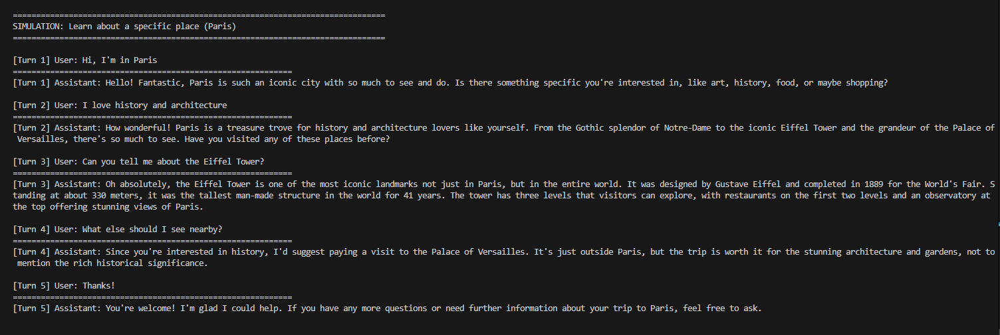
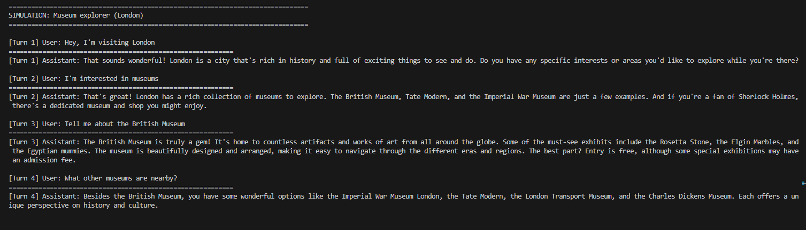
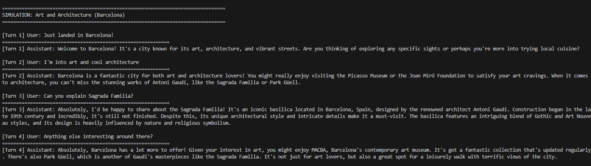

# Navan – Smart Travel Assistant 🧭

## 📌 Table of Content
1. [Overview](#overview)
2. [Features](#features)
3. [Architecture](#architecture)
4. [Agents](#agents)
5. [Conversation Flow](#conversation-flow)
6. [Installation](#installation)
7. [Running the Assistant](#running-the-assistant)
8. [Simulation Examples](#simulation-examples)
9. [Project Structure](#project-structure)
10. [Roadmap](#roadmap)
11. API


## 🧭 Overview

Navan is a conversational travel assistant that helps users explore cities and landmarks through a natural dialogue interface.

**Powered by a multi-agent orchestration system and LLM-based extraction, Navan can:**

- Understand the user's location and interests
- Recommend nearby attractions tailored to preferences
- Provide historical or cultural background on landmarks
- Maintain conversational memory and context

**Goal:** Create a smart, guided conversation flow for travelers that feels intuitive, informative, and helpful – without requiring a GUI or app installation.
---

## ✨ Features

- 🗺️ **Location-aware interactions**  
  Extracts city and country from free-text input and enriches with geolocation data (Geoapify).

- 🎯 **User intent recognition**  
  Classifies user goals such as learning about a place, discovering attractions, or finding events using LLM extraction.

- 🏛️ **Wikipedia integration**  
  Provides reliable summaries about places using Wikipedia and LLM reformulation.

- 🧠 **Multi-turn conversation memory**  
  Tracks context, user preferences, and previously discussed places.

- 🧭 **Attractions recommender agent**  
  Suggests places based on geolocation and preferences (e.g., "art", "nature").

- 📚 **LLM-driven YAML extraction**  
  Uses structured prompts with `system`, `user`, and `assistant` roles for consistent field extraction.

- ⚙️ **Modular agent orchestration**  
  Clear separation of concerns for each agent.

- 🖥️ **CLI simulation interface**  
  Easy to run and test interactions without needing a frontend.

---

## 🏗️ Architecture

### 🧩 Modular Design

| Layer | Description |
|-------|-------------|
| **Orchestrator Agent** | Central controller. Manages conversation state, routes to relevant agents. |
| **Wikipedia Explainer Agent** | Fetches summaries and rewrites them clearly via LLM. |
| **Attractions Agent** | Finds POIs based on geolocation and preferences. |
| **Geoapify Client** | Handles geocoding and attraction lookup. |
| **LLM Extraction** | Extracts structured data from user messages via prompt templates. |
| **Conversation State** | Tracks user location, preferences, and goals. |
| **Navigator** | Converts structured agent outputs into assistant messages. |

---

## 🧠 Prompt Templates

Located in `prompts/`, these define how the LLM behaves per task.

| File | Purpose |
|------|---------|
| `conversation.yaml` | Dialogue guidance |
| `extraction.yaml` | Extract structured fields |
| `wikipedia_prompt.yaml` | Landmark explanation |
| `attractions_prompt.yaml` | Nearby POI suggestions |
| `fallback_prompt.yaml` | Graceful error handling |

Each contains:  
- `system`: LLM role & tone  
- `user`: Instructional format  
- `assistant`: Ideal response structure

---
## 💬 Conversation Flow
```
User
  ↓
Orchestrator Agent
  ├── Attractions Agent ──→ Geoapify / GeoNames
  ├── Wikipedia Explainer Agent ──→ Wikipedia
  └── Location Resolver ──→ GeoNames (+ Google Maps link)
```
```
User input
↓
OrchestratorAgent.handle_message()
↓
returns:
* SlotRequestOutput
* AttractionsAgentOutput
* WikipediaExplainerOutput
↓
ConversationNavigator.navigate(output)
↓
NavigationResponse(text, next_question)
```
---

## 🛠️ Installation

```bash
git clone https://github.com/eyalshub/Navan.git
cd Navan
pip install -r requirements.txt
```
Create your .env file from .env.example and add API keys for:
OpenAI
Geoapify
GeoNames

### ▶️ Running the Assistant
```bash
python scripts/run_cli.py
```
Run Simulated Dialogues:
```bash
python scripts/simulate_conversation.py
```

## Simulation Examples









```bash
travel_assistant/
│
├── app/
│   ├── main.py
│   │   # Application entry point (CLI / runtime bootstrap)
│
│   ├── context.py
│   │   # Global conversation context and shared state helpers
│   |├──llm_conversation_responder.py
│   ├── agents/
│   │   ├── __init__.py
│   │   │   # Agents package
│   │   ├── attractions_agent.py
│   │   │   # Discovers nearby attractions using Geoapify + LLM ranking
│   │   └── wikipedia_explainer_agent.py
│   │       # Explains places using Wikipedia summaries
│
│   ├── conversation/
│   │   └── navigator.py
│   │       # Translates agent outputs into user-facing responses
│   │   └── slot_request.py
│   ├── orchestrator/
│   │   └── extraction.py
│   │   └── orchestrator_agent.py
│   ├──schema/
│   │   ├── agent_response.py
│   ├── guards/
│   │   ├── __init__.py
│   │   │   # Guard layer package
│   │   ├── conversation_guard.py
│   │   │   # Conversation flow constraints and safety checks
│   │   ├── hallucination_guard.py
│   │   │   # Prevents speculative or ungrounded responses
│   │   └── relevance_guard.py
│   │       # Ensures responses remain contextually relevant
│
│   ├── llm/
│   │   ├── __init__.py
│   │   │   # LLM utilities package
│   │   ├── utils.py
│   │   │   # Prompt formatting and response helpers
│   │   ├── client.py
│   │   │   # LLM API wrapper (single access point)
│   │   └── prompt_loader.py
│   │       # Loads YAML-based prompts
│
│   ├── prompts/
│   │   ├── conversation.yaml
│   │   │   # Global system rules and guardrails
│   │   ├── extraction.yaml
│   │   │   # High-level intent planning prompt
│   │   ├── orchestrator.yaml
│   │   │   # Orchestrator decision logic prompt
│   │   ├── wikipedia_explainer.yaml
│   │   │   # Wikipedia explanation prompt
│   │   └── attractions_agent.yaml
│   │       # Attractions ranking and explanation prompt
│
│   ├── tools/
│   │   ├── wikipedia.py
│   │   │   # Wikipedia API adapter
│   │   ├── geo_tool.py
│   │   │   # Shared geographic utility functions
│   │   ├── geoapify_client.py
│   │   │   # Geoapify API client (geocoding & POIs)
│   │   ├── geonames.py
│   │   │   # GeoNames API client (city & POI resolution)
│   │   └── eventbrite.py
│   │       # Event discovery API integration (optional)
│
│   ├── routing/
│   │   ├── place_category_resolver.py
│   │   │   # Maps user preferences to place categories
│   │   └── place_intent.py
│   │       # Resolves place-related intents from text
│
├── scripts/
│   ├── debug_geonames_raw.py
│   │   # Low-level GeoNames API debugging
│   ├── geo_tool_test.py
│   │   # Manual tests for geographic utilities
│   ├── geoapify_demo.py
│   │   # Geoapify usage demo
│   ├── run_cli.py
│   │   # CLI runner for interactive testing
│   ├── test_attractions_agent.py
│   │   # Attractions agent tests
│   ├── test_conversation_navigator.py
│   │   # Conversation rendering tests
│   ├── test_eventbrite_live.py
│   │   # Live Eventbrite API tests
│   ├── test_geonames_live.py
│   │   # Live GeoNames API tests
│   ├── test_llm_live.py
│   │   # Live LLM integration tests
│   ├── test_orchestrator_agent.py
│   │   # Orchestrator behavior tests
│   ├── test_wikipedia_explainer.py
│   │   # Wikipedia explainer agent tests
│   └── test_wikipedia_live.py
│       # Live Wikipedia API tests
│   └── test_llm_conversation_responder
│   └──test_extraction.py
├── transcripts/
│   ├── demo_discovery.md
│   │   # Example attraction discovery conversations
│   ├── demo_history.md
│   │   # Example historical explanation flows
│   └── demo_recovery.md
│       # Edge cases and recovery scenarios
│
├── tests/
│   └── app/
│       # Optional structured test suite
│
├── .env.example
│   # Environment variable template (API keys)
│
├── requirements.txt
│   # Python dependencies
│
├── README.md
│   # Project documentation
│
└── run.sh
    # Optional helper script to start the application
```


## 🧭 Roadmap
✅ Current

* Deterministic multi-agent orchestration
* Wikipedia & Geoapify integration
* Structured YAML-based LLM extraction

🔜 Next
* Event recommendations (Eventbrite/Ticketmaster)
* 3-day itinerary planning
* Persistent memory layer
* Web-based interface

## 💡 Future Ideas
* Multilingual support (Hebrew, Spanish)
* Real-time weather via WeatherAPI
* Booking integration (Skyscanner, Booking.com)
* Mobile version (React Native, Telegram Bot)


## API:
## 🔌 External APIs & Services
All external services are accessed through controlled adapters and are never queried directly
from the user interface.

### Wikipedia API
**Purpose:** Historical and contextual knowledge  
**Used by:** `WikipediaExplainerAgent`

The Wikipedia API is used to retrieve reliable encyclopedic summaries about specific places
(e.g. museums, landmarks, historical sites).  
The raw content is passed to a dedicated explanation agent, which reformulates the information
into a concise, user-friendly response.

This API is invoked only when a concrete place is in focus, preventing open-ended or speculative queries.

---

### Geoapify API
**Purpose:** Geocoding and proximity-based place discovery  
**Used by:** `AttractionsAgent`

Geoapify is used to:
- Resolve city names into geographic coordinates (latitude / longitude)
- Discover nearby points of interest based on user preferences (museums, food, parks, etc.)

All Geoapify queries are grounded in explicit location data and structured preferences,
ensuring consistent and predictable results.

---

### GeoNames API
**Purpose:** Geographic resolution and precise location lookup  
**Used by:** Orchestrator (Location Resolver)

GeoNames is used in two primary scenarios:
- Resolving ambiguous city names when additional geographic confirmation is required
- Locating specific places (points of interest) and retrieving their exact coordinates

When available, GeoNames results are used to generate direct Google Maps links,
allowing users to navigate to the requested location instantly.

---

### Google Maps (Link-based Integration)
**Purpose:** Navigation and user redirection  
**Used by:** Location Resolver

Instead of directly integrating the Google Maps API, the system generates Google Maps
links based on resolved latitude and longitude coordinates.
This approach keeps the system lightweight while still providing accurate navigation capabilities.


## 🎯 Core Agents & Deterministic Orchestration

### Deterministic Orchestrator (Core Feature)

At the heart of the system lies a **deterministic Orchestrator Agent**, which serves as the central control unit of the Travel Assistant.

The orchestrator is responsible for:
- **Intent detection** – identifying what the user is trying to achieve (e.g. discovery, explanation, navigation)
- **Short-term conversation management** – maintaining a lightweight conversational memory
- **State tracking** – persistently storing:
  - the last known city
  - the last referenced place
  - contextual cues required for follow-up questions
- **Follow-up resolution** – enabling natural continuations such as:
  - “Tell me more about it”
  - “What else is nearby?”
  - “How do I get there?”

Unlike probabilistic chat flows, the orchestrator follows explicit decision rules and routing logic, ensuring predictable behavior and minimizing ambiguity or hallucinations.

---

### Wikipedia Explainer Agent

The **Wikipedia Explainer Agent** is a research-backed explanation agent focused on delivering accurate and grounded historical or contextual information.

Its workflow:
1. Receives a **concrete place** selected by the orchestrator  
2. Fetches a **summary of the relevant Wikipedia article**  
3. Uses this verified source material as grounding  
4. Generates:
   - a clear explanation
   - key historical or cultural insights
   - interesting facts or highlights  

The agent does **not invent information** and never operates without an explicit Wikipedia source, making it suitable for factual explanations of landmarks, museums, and historical sites.

---

### Attractions Agent

The **Attractions Agent** is responsible for discovering nearby places of interest based on geographic data and user preferences.

Its operation consists of multiple deterministic stages:

**Stage A – Discovery**
- Receives a city name or geographic coordinates
- Uses **Geoapify** to retrieve nearby POIs such as:
  - attractions
  - museums
  - restaurants
  - landmarks
  - points of interest

**Stage B – Validation**
- Each candidate place is validated using **GeoNames**
- Ensures:
  - the place actually exists
  - the name is reasonable
  - the geographic location is coherent

**Stage C – Ranking**
- The validated places are ranked according to relevance and priority
- The agent returns a **sorted list** with:
  - place names
  - short descriptive summaries
  - clear categorization

This layered approach prevents noisy or fabricated results and ensures high-confidence recommendations.

---

### Location Resolver (Navigation Feature)

The **Location Resolver** is a dedicated utility responsible for precise navigation support.

Given a validated attraction or place, it:
- Resolves exact latitude and longitude
- Generates a **Google Maps link**
- Allows instant navigation without requiring a direct Google Maps API integration

This keeps the system lightweight while still providing practical, real-world usability.

---

## 🛡️ Guard Layer (Safety & Control)

The system includes an explicit **Guard Layer** that enforces reliability and conversational discipline across all agents.

### Hallucination Guard
- Blocks responses that are not grounded in a verified source
- Prevents speculative or fabricated explanations

### Relevance Guard
- Ensures responses stay aligned with the current topic
- Prevents drifting into unrelated recommendations or explanations

### Conversation Guard
- Enforces valid conversation flow
- Prevents broken transitions, invalid follow-ups, or contradictory states

Together, these guards ensure that the assistant behaves as a **controlled, trustworthy system** rather than an open-ended chatbot.


User input
  ↓
OrchestratorAgent.handle_message()
  ↓
returns:
  - SlotRequestOutput
  - AttractionsAgentOutput
  - WikipediaExplainerOutput
  ↓
ConversationNavigator.navigate(output)
  ↓
NavigationResponse(text, next_question, suggested_intent)


